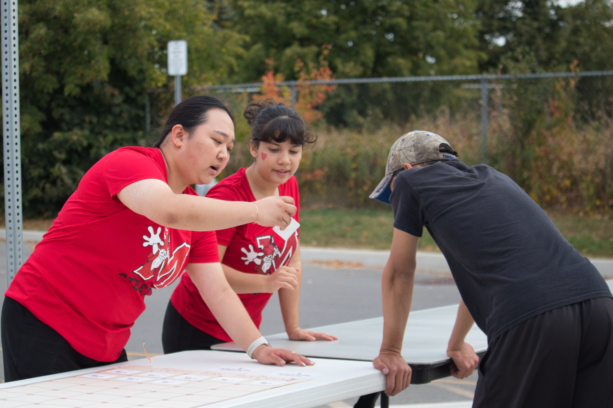
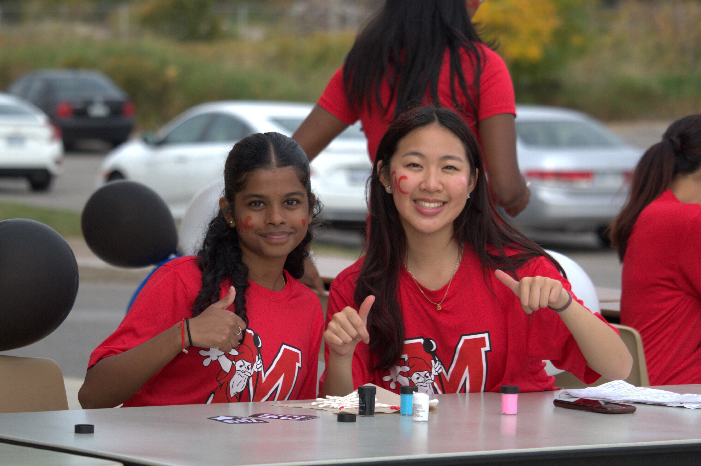
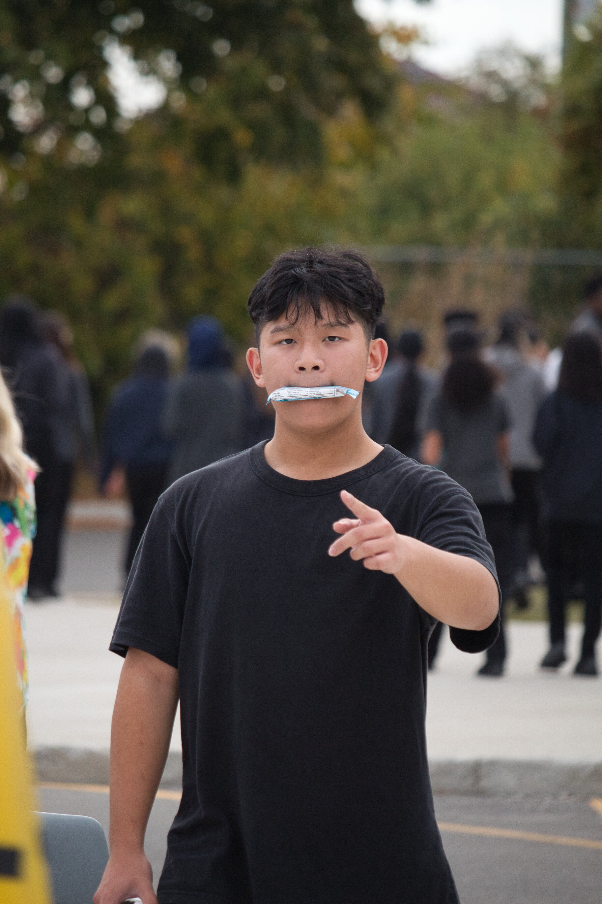
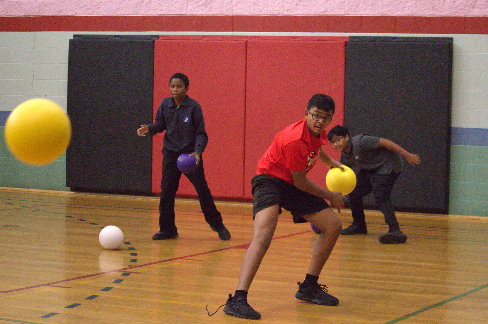
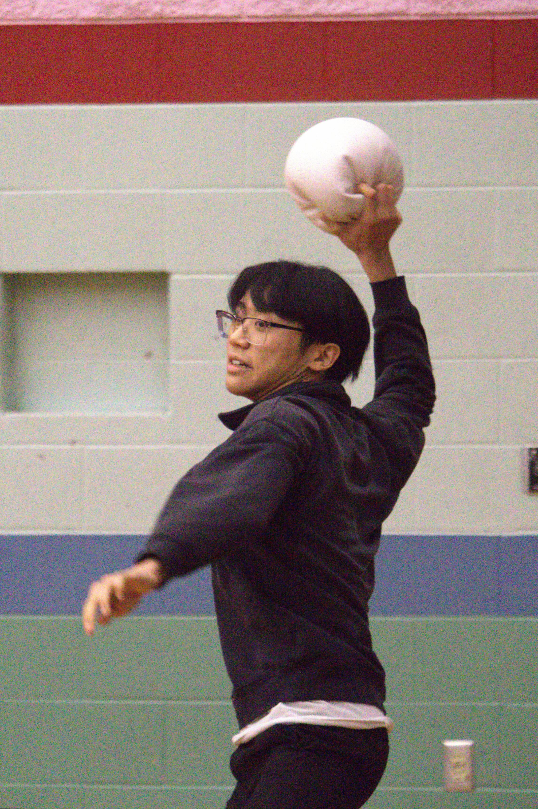
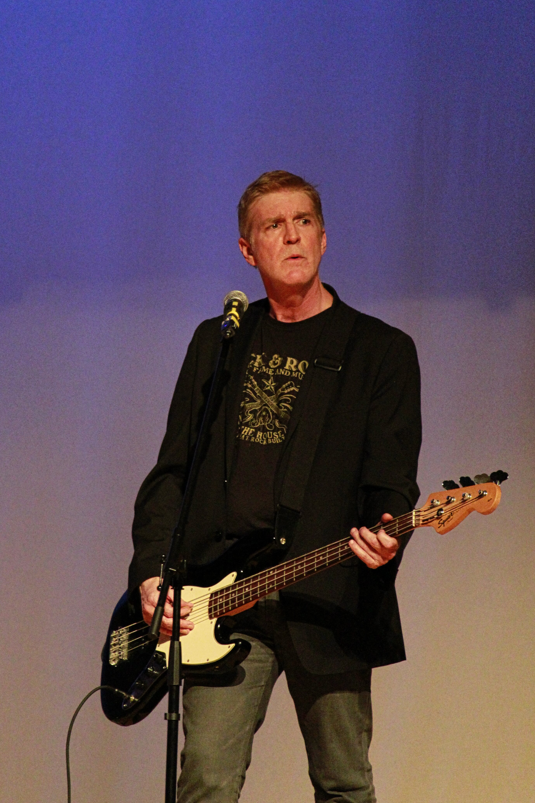
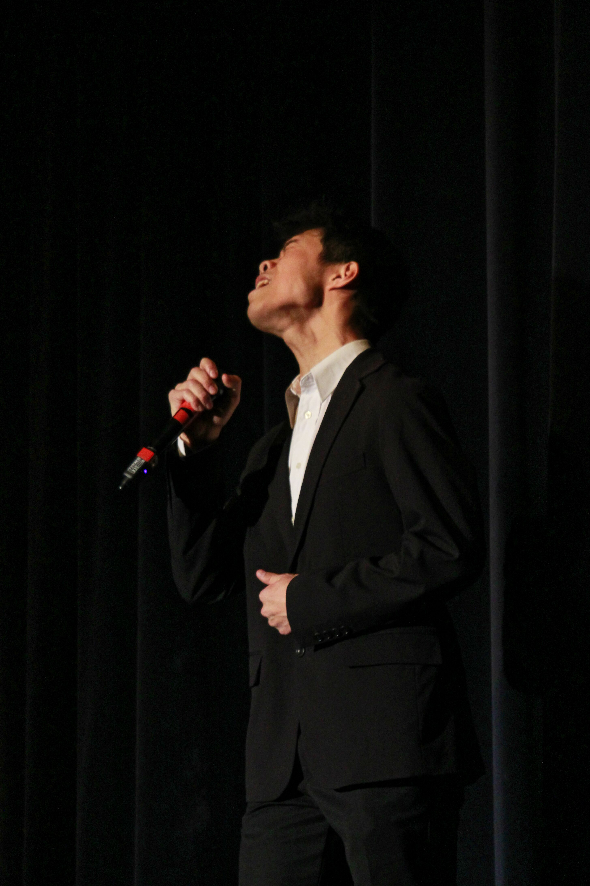

<html><head><meta http-equiv="Content-Type" content="text/html; charset=utf-8"/><title>Nigel Li   |  Photography Portfolio</title></head><body><article id="1a6a05dd-ba69-80c8-9e3f-c593326146fb" class="page serif"><header>
📷
<h1 class="page-title">Nigel Li   |  Photography Portfolio</h1>

</header>

<figure id="1a6a05dd-ba69-8199-b7b8-c65a990382f6" class="image"></figure>

I’m a photographer with over five years of experience in event, street and nature photography. From a young age, I developed a passion for capturing authentic moments and telling visual stories through my lens. My work focuses on blending creativity with technical skill to create compelling, high-quality images that evoke emotion and narrative from my perspective.

<strong>📩 Contact Me</strong>

Have a project in mind or just want to connect? Feel free to reach out! 📧 Email:  <a href="mailto:Nigel.Li@mail.utoronto.ca">Nigel.li@mail.utoronto.ca</a> 📷 Instagram:  <a href="https://www.instagram.com/nigel.li_">@nigel.li_</a>

<h1 id="1a6a05dd-ba69-8154-ad9e-f9a66e992426" class="">Event Photography</h1>

<h2 id="1a6a05dd-ba69-80f4-a71a-ed5aa33cf9ad" class="">Sports</h2>

<figure id="1a6a05dd-ba69-8083-9f0c-e857f0d090ad" class="image"></figure>

<figure id="1a6a05dd-ba69-809c-8d9b-d2499c79a26a" class="image"></figure><figure id="1a6a05dd-ba69-80b0-b91d-f94f268430f0" class="image"></figure>

<figure id="1a6a05dd-ba69-80e8-abdf-d0e0e9accff6" class="image"></figure>

<figure id="1a6a05dd-ba69-8008-890e-e08a6fd936cf" class="image"></figure>

<figure id="1a6a05dd-ba69-8096-8a00-d1df1b882ea1" class="image"></figure>

<figure id="1a6a05dd-ba69-80df-a3c1-f83576dd922f" class="image"></figure>

<h2 id="1a6a05dd-ba69-80d7-b8d6-d50fb4c95cd3" class="">Concerts</h2>

<figure id="1a6a05dd-ba69-8071-b8c6-f34f87f7fa37" class="image"></figure>

<figure id="1a6a05dd-ba69-8045-9759-dc04d4333a4a" class="image"></figure>

<figure id="1a6a05dd-ba69-8019-ba19-cebff18a0cca" class="image"></figure>

<figure id="1a6a05dd-ba69-80ce-ba3b-f9d451bfbba2" class="image"></figure>

<h1 id="1a6a05dd-ba69-80e2-8954-dd8d3057f38f" class="">Street Photography</h1>

<figure id="1a6a05dd-ba69-80d2-a29d-ed07775cc723" class="image"></figure>

<figure id="1a6a05dd-ba69-8054-acf1-c2e4de183019" class="image"></figure>

<figure id="1a6a05dd-ba69-802c-b04b-e6ccadd633dd" class="image"></figure>

<h1 id="1a6a05dd-ba69-80c8-9a9f-eeaaccd952be" class="">Nature Photography</h1>

<figure id="1a6a05dd-ba69-808a-9980-e9f59f319123" class="image"></figure>

<figure id="1a6a05dd-ba69-805a-ac46-e5b78233ff6b" class="image"></figure>

<figure id="1a6a05dd-ba69-8073-83bc-e6ed12fdc7ba" class="image"></figure>

</article></body></html>
